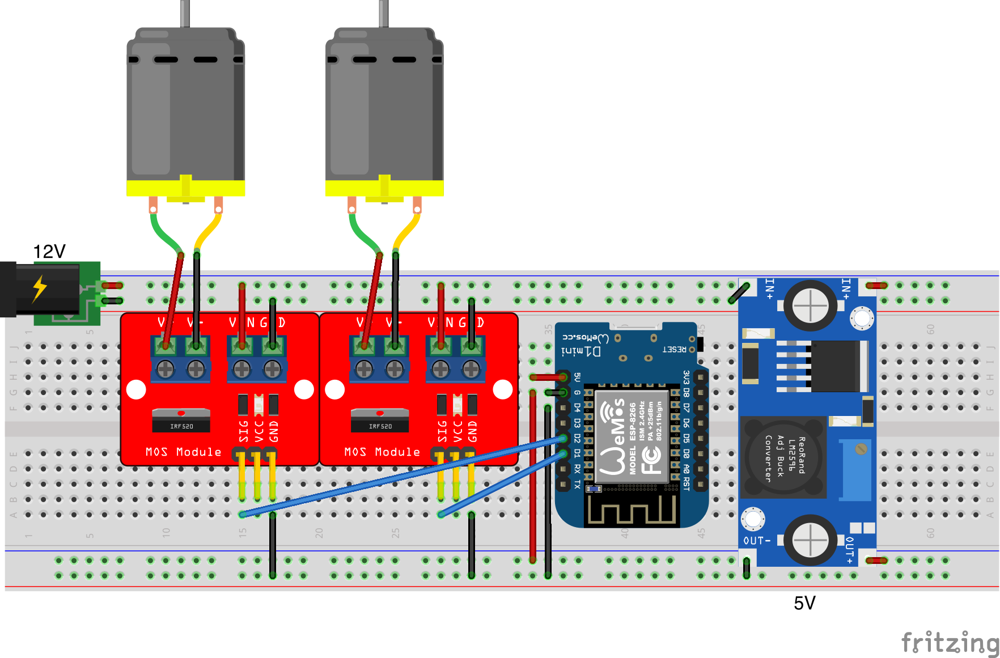

# ESP8266 / ESP32 wifi fan control

pwm fan control with mosfet and autoconnect

Set fan speed with GET parameter `speed` from `0` to `100` percent:

http://esp-IP/fan/1?speed=30

http://esp-IP/fan/2?speed=100

##### Quickstart

**ESP8266**

Download [binary](https://github.com/tsgoff/esp-fan-pwm-control/releases/)

`esptool.py write_flash 0x0 ./fancontrol_XXX_ESP8266.bin`

